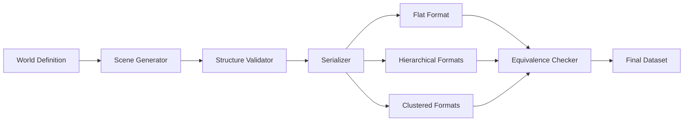

# Dataset Documentation

This document provides detailed information about the dataset structure, generation process, and validation methods.

## 📋 Dataset Overview

### Total Scale
- **Total Scenes**: 25
  - R1 (Simple): 10 scenes
  - R2 (Complex): 10 scenes
  - conflict (Conflict): 5 scenes
- **Total Queries**: 1,250
- **Format Variants**: 7 per scene
- **Total Samples**: 57,500+

### Generation Method

**Key Principle**: The dataset is generated through **fully automated, rule-based serialization** with:
- ✅ No human annotation
- ✅ No LLM-based annotation
- ✅ Deterministic generation (seed-controlled)
- ✅ Information equivalence guarantee

## 🏗️ Scene Structure

### World Representation

Each scene contains a structured `world` object:

```json
{
  "scene_name": "scene_complex_01",
  "gradient": "G1",
  "gradient_label": "Basic cognition",
  "rooms": [
    {
      "idx": 0,
      "room_id": "R1",
      "type": "Reception",
      "x": 0,
      "y": 0
    }
  ],
  "edges": [[0, 1], [1, 2]],
  "objects": {
    "0": [["Furniture", "Table"], ["IT", "Monitor"]]
  },
  "history": [5, 2, 3],
  "rules": [
    "When generating a path, output the shortest valid path..."
  ]
}
```

### Room Properties
- `idx`: Zero-based index
- `room_id`: Human-readable ID (e.g., "R1", "R2")
- `type`: Semantic type (e.g., "Reception", "Kitchen")
- `x`, `y`: Geometric coordinates

### Graph Properties
- `edges`: List of [u, v] pairs representing door connections
- `history`: Movement trace of a key object
- `objects`: Room-wise object inventory

## 🔄 Format Variants

### 1. Flat Format (`flat`)

Natural language narrative describing the scene:

```
You are in a smart campus. You start at the Reception (R1), located at (0,0),
which features a sleek counter and a wooden bench...
```

**Characteristics**:
- Human-readable prose
- Information embedded in narrative flow
- Suitable for natural language models

### 2. Hierarchical Format (`hier`, `hier_50`, `hier_25`)

Structured representation with explicit hierarchy:

```
[SCENE: Smart Campus]
- [ROOM R1: Reception @ (0,0)]
  - [Objects: Furniture(Counter, Bench), IT(Server, Monitor)]
...
[TOPOLOGY] R1-R2, R2-R3, ...
[HISTORY] Master_Key: R6(t1) -> R2(t2) -> R3(t3)
```

**Compression Levels**:
- `hier` (0%): Full details
- `hier_50` (50%): Abbreviated categories, truncated names
- `hier_25` (75%): Maximum compression, numeric indices

### 3. Clustered Format (`clustered`, `clustered_50`, `clustered_25`)

Zone-based spatial clustering:

```
[SCENE: Smart Campus]
- [ZONE A: Admin & Support (R1, R2, R6)]
  - [R1, R2, R6 Objects]: {Furniture, IT, Storage, Security}
- [ZONE B: Instructional (R3, R4, R5)]
  - [R3, R4, R5 Objects]: {Instruments, Audio, Furniture}
...
```

**Characteristics**:
- Rooms grouped by spatial proximity
- Zone-level summaries
- Efficient for large scenes

## 📊 Query Types

### ObjectLocation
```
Question: Where is the Master_Key currently located?
Answer: R6
```

### GeometryYN
```
Question: Is the Kitchen (R2) located North of the Entrance (R1)?
Answer: YES
```

### TopologyYN
```
Question: Is there a direct connection between R1 and R3?
Answer: NO
```

### ReachabilityYN
```
Question: Can you reach R3 from R1?
Answer: YES
```

### PathGen
```
Question: Provide the shortest path from R1 to R3.
Answer: R1->R2->R3
```

## ✅ Information Equivalence Guarantee

### Validation Criteria

All format variants must preserve:

1. **Room Identity**: All `room_id` values appear in text
2. **Topology**: Connection information is encoded (explicitly or implicitly)
3. **History**: Object movement trace is recoverable
4. **Semantics**: Room types and objects are represented

### Verification Script

```bash
python tools/validate_dataset.py --check_equivalence --verbose
```

Sample output:
```
[R1]
  ✓ scene_01: All variants encode same information
  ✓ scene_02: All variants encode same information
...

[R2]
  ✓ scene_complex_01: All variants encode same information
...
```

## 🔬 Reproducibility

### Generation Pipeline



### Determinism

```python
# Generate identical dataset with same seed
python tools/generate_dataset.py --seed 42
```

### Validation

```python
# Comprehensive validation
python tools/validate_dataset.py \
    --base_dir ./data_set \
    --validate \
    --check_equivalence \
    --verbose
```

## 📈 Dataset Statistics

| Metric | R1 | R2 | conflict | Total |
|--------|----|----|-------|-------|
| Scenes | 10 | 10 | 5 | 25 |
| Queries | 500 | 500 | 250 | 1,250 |
| Variants | 7 | 7 | 7 | 7 |
| Total Samples | 3,500 | 3,500 | 1,750 | 8,750 |

**Note**: With multiple configurations (L1-L4 prompt templates), total reaches **57,500** samples.

## 🔧 Extending the Dataset

### Adding New Scenes

1. Create world definition in `data_set/YOUR_DATASET/scene/`
2. Run generation script:
```bash
python tools/generate_dataset.py --output_dir ./data_set/YOUR_DATASET
```

### Adding New Query Types

1. Extend `generate_queries_for_scene()` in `tools/generate_dataset.py`
2. Add validation logic in `tools/validate_dataset.py`
3. Update documentation

## 📖 Citation

```bibtex
@dataset{navigation_planning_2025,
  title={Navigation Planning Dataset for LLM Spatial Reasoning},
  author={Research Team},
  year={2025},
  publisher={GitHub},
  url={https://github.com/yourusername/navigation-planning-llm}
}
```

## 📞 Support

For questions about the dataset:
- Open a GitHub issue
- Check existing documentation
- Contact maintainers
